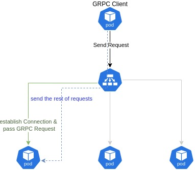
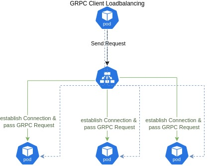
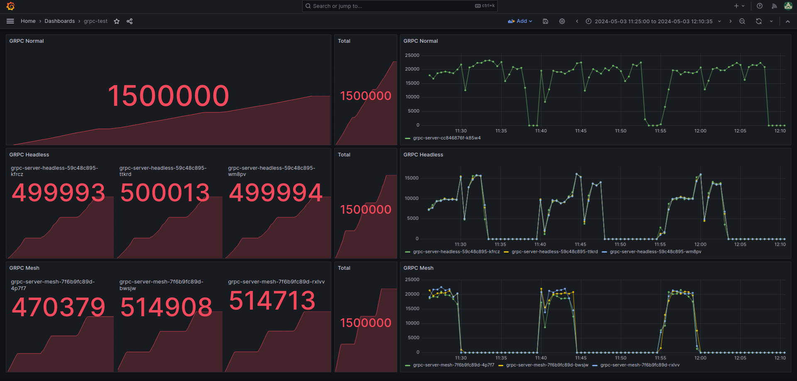
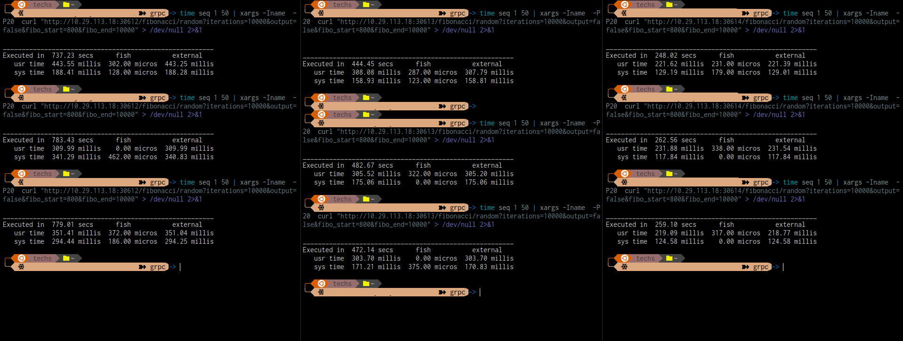
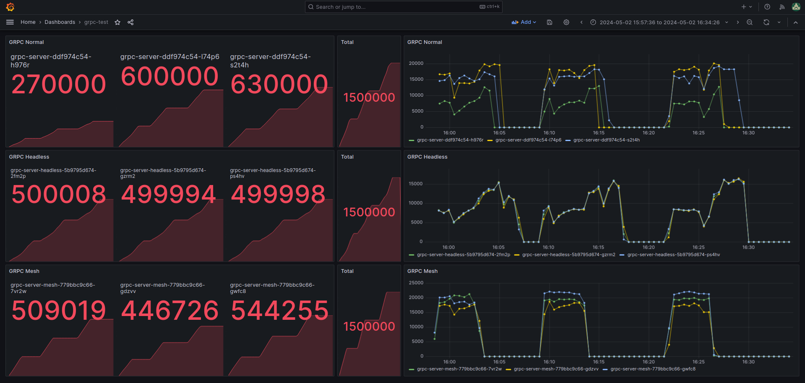
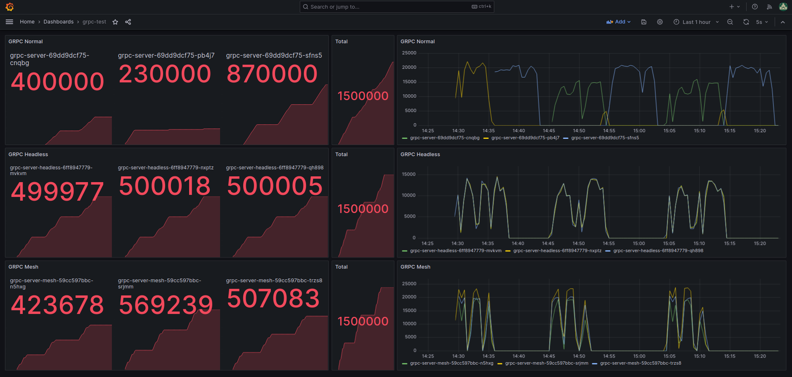
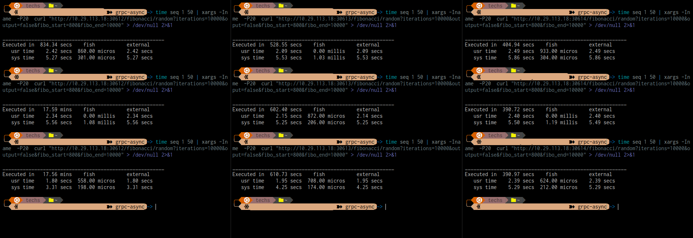

[](https://github.com/gruppferi/grpc-service-comparison/actions/workflows/gh_action.yml)

# grpc-service-comparison
This weekend project began when my colleagues requested a service mesh in our stack due to Kubernetes service load balancing, which doesn't align well with the GRPC protocol.

While I enjoy experimenting with new technology, it is essential for DevOps professionals to adopt an R&D (Research & Development) mindset. Before implementing anything, conduct thorough research, familiarize yourself with the technology, gather metrics, and make comparisons. Once you're confident, you can integrate the new technology into your stack.

I can't guarantee that my colleagues who read this README will immediately 😉 get what they asked for, but with the rise of GRPC, the metrics support the use of Service Mesh. Prepare for some insightful graphs and metrics!

Enough talk—let's dive in and get started!

## Scope
The goal of this project is to compare GRPC service communication methods within Kubernetes using an HTTP REST endpoint to trigger GRPC Client, sends GRPC requests to GRPC Server. The following three communication methods are part of the scope:

* GRPC communication over a standard Kubernetes Service.
* GRPC communication over a Kubernetes Headless Service.
* GRPC communication over Linkerd Service Mesh.

### What does the communication flow look like?
#### GRPC Communication over a Standard Kubernetes Service
A standard Kubernetes Service can typically handle round-robin load balancing of GRPC requests. However, this might not perform as expected for long-lived streaming connections like GRPC do.<br>



#### GRPC Communication over Kubernetes Headless Service
When using GRPC with a Kubernetes headless service, the GRPC client can handle load balancing, but this requires extra effort on the client side.<br> There are different possible load balancing methods, but here we focus on round-robin load balancing on the GRPC client, where each client balances its requests.



#### GRPC Communication over Linkerd Service Mesh
A service mesh is an infrastructure layer that manages and controls service-to-service communication in microservices applications.<br>It offers features such as load balancing, security, and observability through sidecar proxies attached to each service.


## Setup
### Prerequisites
* I assume you have basic knowledge of GRPC, Kubernetes, and Service Mesh; otherwise, you wouldn't have read this far 😉.
* You should have a Kubernetes environment set up for this test, including Prometheus and Grafana.

### Pre-Deployment
As one scenario requires a service mesh, if you don't already have one installed, I recommend Linkerd because it is straightforward to set up. Instead of explaining how to install it here, I suggest following this  [Linkerd Getting Started](https://linkerd.io/2.15/getting-started/), guide up to Step 4. We will handle the rest below.

### Deployment
**ATTENTION**: Applying the example below is not covering async example. If you like to try async, please follow exact same below steps only the directory name is "grpc-client-async" & "grpc-server-async"


1. In the grpc-server directory, there is a folder named kubernetes that you need to apply. This will:
* Create a namespace.
* Deploy three types of GRPC servers into the created namespace..
<br>
```
kubectl apply -f grpc-server/kubernetes/
```
2. Since you have already completed the pre-deployment steps, now proceed to Step 4, which involves injecting the Linkerd labels to integrate the deployments into the mesh.
```
cat grpc-server/kubernetes/grpc-server-mesh.yaml | linkerd inject - | kubectl apply -f -
```

After injecting the Linkerd labels, the deployment grpc-server-headless-mesh will be restarted. Please verify that it is running properly after the restart, with each pod containing 2 out of 2 containers.
<br>

3. Now lets apply the GRPC clients.
```
kubectl apply -f grpc-client/kubernetes/
```
Afterward, we need to inject the Linkerd proxy into the GRPC client as well.
```
cat grpc-client/kubernetes/grpc-client-mesh.yaml | linkerd inject - | kubectl apply -f -
```
After injecting the Linkerd proxy, the deployment grpc-client-mesh will be restarted. Please verify that it is running properly after the restart, with each pod containing 2 out of 2 containers.

### Post Deployment
From the grafana directory, copy the contents of grafana.json. Log in to your Grafana instance and add a dashboard by importing the JSON file.
If you are unsure how to add a dashboard, follow this [Add/Import Dashboard to Grafana](https://grafana.com/docs/grafana/latest/dashboards/build-dashboards/import-dashboards/).

### Post check
Ensure that all your pods in the grpc namespace are running and that your dashboard in Grafana shows "No data."

## Run Test
If you have a terminal emulator, it would be helpful to split the screen into three panes. If not, you can still run the commands in different tabs or windows as you prefer.<br>
If you use a split terminal, place each of the commands below into a split window and group all your split screens.<br>
Change `<NODE_IP>` to one of your Kubernetes worker IPs.<br>
Let me explain what each part of the command does:
* **time**: Measures the time taken for the command to execute.
* **seq 1 50**: Generates a sequence of numbers from 1 to 50 (inclusive) and outputs each number on a new line.
* **xargs -Iname**: Takes input from the `seq` command (numbers 1-50) and executes a command using each input as an argument.
* **-I name**: Replaces occurrences of `name` in the command with the current input from `seq`.
* **-P20**: Allows `xargs` to run up to 20 processes in parallel, which is useful for simulating parallel users.
* **curl**: You know what it does.
* **/fibonacci/random**: This path calls the Fibonacci function. There is another path that acts as an incrementer, but it's not relevant for this example.
* **iterations**: The number of times to request a random Fibonacci number.
* **output**: Displays the output of the calculated Fibonacci number or prints simple text.
* **fibo_start & fibo_end**: Specifies the randomized range.
<br>

Each port in the URL references a flavor of the GRPC deployment.
* **30612**: GRPC server with a standard Kubernetes service.

```
time seq 1 50 | xargs -Iname  -P20  curl "http://<NODE_IP>:30612/fibonacci/random?iterations=10000&output=false&fibo_start=800&fibo_end=10000" > /dev/null 2>&1
```

* <b>30613</b>: GRPC server with Kubernetes headless service.
```
time seq 1 50 | xargs -Iname  -P20  curl "http://<NODE_IP>:30613/fibonacci/random?iterations=10000&output=false&fibo_start=800&fibo_end=10000" > /dev/null 2>&1
```

* <b>30614</b>: GRPC server under service mesh.
```
time seq 1 50 | xargs -Iname  -P20  curl "http://<NODE_IP>:30614/fibonacci/random?iterations=10000&output=false&fibo_start=800&fibo_end=10000" > /dev/null 2>&1
```

## Output
**Disclaimer**: The measurements done here can vary between environments due to differences in hardware generation, network conditions, current cluster load, and other factors. It's also worth mentioning that writing the program differently or using another programming language may result in different values.

### Scenario #1:
#### Single-Threaded GRPC Server and Client
In this scenario, both the GRPC server and client run in a single thread. The clear winner is, of course, Service Mesh, followed by the headless service.

#### Parameters:
* Iteration/GRPC request: 10,000
* Fibonacci start and end: 800 - 1,000
* Number of parallel processes/users/service requests: 50

#### Output:
On average:
* GRPC communication over a normal Kubernetes service: **~766.55 sec**
* GRPC communication over a Kubernetes headless service: **~466.42 sec**
* GRPC communication over Linkerd Service Mesh: **~256.56 sec**

Sample of one of the request groups:
Each plot points where requests are zero, indicating when one request ended and the next one was manually fired after a few seconds.

On the left side of the Grafana dashboard, you can see the traffic to each pod. It shows that Service Mesh has a different strategy for delivering requests to pods compared to headless service, which uses a round-robin approach.




### Scenario #2:
#### Multi-Threaded GRPC Server and Client
In this scenario, the normal Kubernetes service takes precedence over the headless service but remains behind the Service Mesh. An interesting observation is that there appears to be some level of load balancing on the normal Kubernetes service, even without the use of Service Mesh or headless service. Check the first row of the Grafana dashboard.

#### Parameters:
* Iteration/GRPC request: 10,000
* Fibonacci start and end: 800 - 1,000
* Number of parallel processes/users/service requests: 50

#### Output:
On average:
* GRPC communication over a normal Kubernetes service: **~401.15 sec**
* GRPC communication over a Kubernetes headless service: **~481.62 sec**
* GRPC communication over Linkerd Service Mesh: **~263.56 sec**




### Scenario #3:
#### Single-Threaded GRPC Server and Multi-Threaded Client
In this scenario, there is no significant difference, and it closely resembles Scenario #1.

### Scenario #4:
#### Multi-Threaded GRPC Server and Single-Threaded Client
In this scenario, there is no significant difference, and it closely resembles Scenario #1.

### Scenario #5:
#### Async GRPC Client and Server
With the asynchronous method on both the client and server sides, the communication over the normal Kubernetes service performs very poorly, averaging around 17.4 minutes. <br>
An interesting point to note is that some level of load balancing occurs, with other pods also being triggered to handle the traffic.

#### Parameters:
* Iteration/GRPC request: 10,000
* Fibonacci start and end: 800 - 1,000
* Number of parallel processes/users/service requests: 50

#### Output:
On average:
* GRPC communication over a normal Kubernetes service: **~17.4 min**
* GRPC communication over a Kubernetes headless service: **~603.01 sec**
* GRPC communication over Linkerd Service Mesh: **~311.82 sec**




## Conclusion
* Service Mesh is the ideal technology for GRPC load balancing and performance.
* Kubernetes headless service is a good alternative if you cannot introduce Service Mesh due to learning, maintenance, or resource constraints.
* Normal Kubernetes service may work in rare cases.

**Disclaimer**: These results and code reflect my current knowledge. If you plan to use GRPC, I highly recommend conducting similar tests to find what best fits your needs.<br>
This is meant to serve as a motivational or guiding example.

## Cleanup
For cleaning up the async, run below commands:
```
kubectl delete -f grpc-client-async/kubernetes/
kubectl delete -f grpc-server-async/kubernetes/
```
For cleaning up the other example, run below commands:
```
kubectl delete -f grpc-client/kubernetes/
kubectl delete -f grpc-server/kubernetes/
```
## Contribution
If you find this information useful and have ideas, fixes, or improvements, feel free to submit a pull request.

## Extra
If you wish to reset the metrics values in Prometheus to 0 to start your dashboard with a clean slate after each test, you can port-forward Prometheus if it is running inside Kubernetes. To delete metrics, Prometheus must have the Admin API enabled.<br>
You can enable it by modifying the `values.yaml` file or template of Prometheus and applying it back to the [Prometheus Helm chart](https://github.com/prometheus-community/helm-charts/blob/main/charts/kube-prometheus-stack/values.yaml#L3385).

```
prometheus:
    prometheusSpec:
        enableAdminAPI: true
```
once you portforwarded your prometheus like example below:
```
kubectl port-forward service/prometheus-operator-kube-p-prometheus 9091:9090 -n monitoring

```
In order to reset the local cache to not push old value again, restart deployments in grpc namespace by doing so:
```
kubectl rollout -n grpc restart deployment --all
```
You can run in another terminal the request below to delete metrics from Prometheus.
```
curl -X POST -g 'http://localhost:9091/api/v1/admin/tsdb/delete_series?match[]=grpc_requests_total'
```


